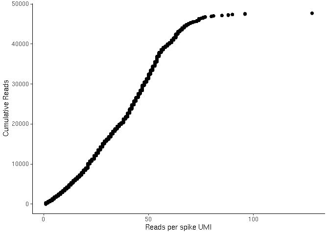

<!-- README.md is generated from README.Rmd. Please edit that file -->

# UMIcountR

<!-- badges: start -->

<!-- badges: end -->

## Molecular Spikes

For information on obtaining molecular spikes, reference fasta and more,
please visit the [molecular spikes GitHub
repo](https://github.com/sandberg-lab/molecularSpikes).

## Installation

You can install UMIcountR from [GitHub](https://github.com/) with:

``` r
# install.packages("devtools")
devtools::install_github("cziegenhain/UMIcountR")
```

## Example

This is a basic example which shows you how to load and analyse some
molecular spikes data:

``` r
library(UMIcountR)
## basic example code
#load reads from the provided example bam file (Smart-seq3 data)
bam_path <- system.file("extdata", "Smartseq3.TTACCTGCCAGATTCG.bam", package = "UMIcountR", mustWork = TRUE)

#in the case of the simple v1 molecular spike
spikedat <- extract_spike_dat(bam_path, match_seq_before_UMI = "GAGCCTGGGGGAACAGGTAGG", match_seq_after_UMI = "CTCGGAGGAGAAA")
#> [1] "Reading in data from bam file..."
#> [1] "Hamming correct spikeUMIs..."

#in the case of the complex molecular spikes set
data("molspike_barcodes_infos_fivep_final")
#spikedat <- extract_complex_spike_dat(bam_path, bc_df = spike_info, max_pattern_dist = 3)
```

After loading the data, we can see the data structure:

``` r
str(spikedat)
#> Classes 'data.table' and 'data.frame':   47727 obs. of  13 variables:
#>  $ contig      : Factor w/ 195 levels "1","10","11",..: 195 195 195 195 195 195 195 195 195 195 ...
#>  $ pos         : int  5641 5641 5641 5641 5641 5641 5641 5641 5641 5641 ...
#>  $ CIGAR       : chr  "53M" "53M" "53M" "53M" ...
#>  $ seq         : chr  "GAGCCTGGGGGAACAGGTAGGTAGTGTTGACTACTCGAGCTCGGAGGAGAAAA" "GAGCCTGGGGGAACAGGTAGGACTTGCGCGGTGAGCAAGCTCGGAGGAGAAAA" "GAGCCTGGGGGAACAGGTAGGTTCCAAAAGCAACTCGAGCTCGGAGGAGAAAA" "GAGCCTGGGGGAACAGGTAGGCTTCGTATATTCATTGAGCTCGGAGGAGAAAA" ...
#>  $ BC          : chr  "TTACCTGCCAGATTCG" "TTACCTGCCAGATTCG" "TTACCTGCCAGATTCG" "TTACCTGCCAGATTCG" ...
#>  $ QU          : chr  "EEEEEEEE" "EEEEEEEE" "EEEEEEEE" "EEEEEEEE" ...
#>  $ UX          : chr  "ACTGAGTG" "AGTGGACA" "AAAGGCCC" "AATCATAA" ...
#>  $ UB          : chr  "ACTGAGTG" "AGCGGACA" "AAAGTCCC" "AATCATGA" ...
#>  $ TSSseq      : chr  "GAGCCTGGGGGAACAGGTAGG" "GAGCCTGGGGGAACAGGTAGG" "GAGCCTGGGGGAACAGGTAGG" "GAGCCTGGGGGAACAGGTAGG" ...
#>  $ spikeUMI    : chr  "TAGTGTTGACTACTCGAG" "ACTTGCGCGGTGAGCAAG" "TTCCAAAAGCAACTCGAG" "CTTCGTATATTCATTGAG" ...
#>  $ seqAfterUMI : chr  "CTCGGAGGAGAAAA" "CTCGGAGGAGAAAA" "CTCGGAGGAGAAAA" "CTCGGAGGAGAAAA" ...
#>  $ spikeUMI_hd1: chr  "TAGTGTTGACTACTCGAG" "ACTTGCGCGGTGAGCAAG" "TTCCAAAAGCAACTCGAG" "CTTCGTATATTCATTGAG" ...
#>  $ spikeUMI_hd2: chr  "TAGTGTTGACTACTCGAG" "ACTTGCGCGGTGAGCAAG" "TTCCAAAAGCAACTCGAG" "CTTCGTATATTCATTGAG" ...
#>  - attr(*, ".internal.selfref")=<externalptr>
```

Next, we can run the filtering for overrespresented spUMIs:

``` r
overrep <- get_overrepresented_spikes(spikedat, readcutoff = 75)
overrep$plots[[1]]
```



You could also apply directional-adjacency error correction to the
Smart-seq3 UMI in the test data:

``` r
spikedat[, UB_directional := return_corrected_umi(UX, editham = 1, collapse_mode = "adjacency_directional"), by = BC]
```

To downsample the copy number of the molecular spikes in your data to a
relevant “expression level” of interest, you can use the following
function:

``` r
spikedat_mean100 <- subsample_recompute(spikedat, mu_nSpikeUMI = 100, threads = 4)
```

## Reference

Molecular spikes: a gold standard for single-cell RNA counting
<[https://www.nature.com/articles/s41592-022-01446-x](https://www.nature.com/articles/s41592-022-01446-x)>
